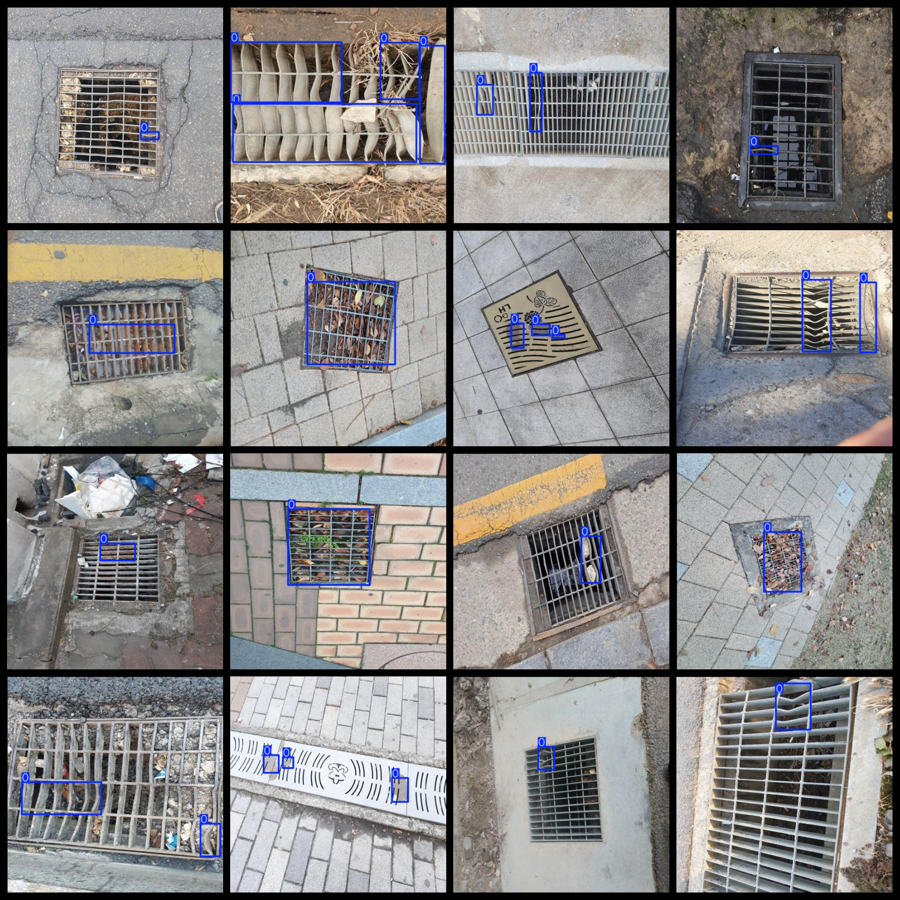

# City Rain Water Well Drain Water grille. Defect Detection Dataset 1830 imagesVOC+YOLO format

Urban rainwater well drainage grid defect detection data set 1830 VOC + YOLO format

Dataset format: Pascal VOC format + YOLO format (the txt file does not contain the split path, it only contains jpg images and corresponding VOC format xml files and yolo format txt files)

Number of images (number of jpg files): 1830

Tagged quantity: 1830

Number of txt files: 1830

Number of categories: 1

The Github repository is: datasets_sl

Annotation class names: ["0"]

Number of boxes labeled in each category:

0 frame count = 3066

Total frames: 3066

Number of images per category:

0. 03146

Image resolution: 416x416

Use the labeling tool: labelImg

Dataset Augmentation: Yes

Rules for annotation: Draw a rectangle around the category.

Important note: Dataset without split training validation test collect need to do it yourself split （Defect mainly yes various Missing 、deformation 、rust 、stain and Blockage etc. condition ，not Classification annotation ，uniformly as one Labels ）

Special Disclaimer: This dataset does not guarantee the accuracy of the trained models or weight files.

Annotation and image details are as follows:

## Images

---

Here is a pay link on Stripe (https://buy.stripe.com/3cs8yP7sY87d0vu9AB). Please contact me lonlonago@foxmail.com after funding $89, and I will send you a complete data files, thank you!

